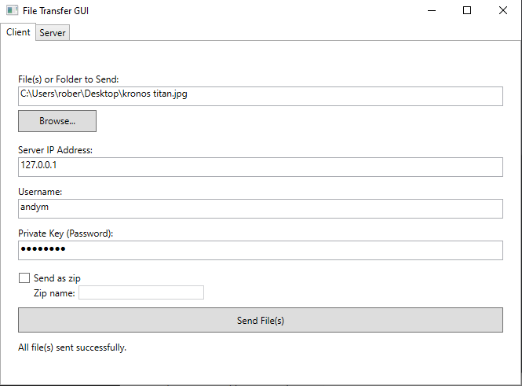

# FileTransferApp

A **secure, cross-platform file-transfer utility** written in C#/.NET 8. The solution contains three sibling projects:

| Project | Type | Purpose |
|---------|------|---------|
| `Server` | Console app | Listens on port 5000 and receives files. |
| `Client` | Console app | Sends a file to the server (handy for automation / scripting). |
| `GUI`    | WPF desktop app | Friendly interface that can start/stop the server, manage users and send files or whole folders. |

<p align="center">
  
  <br/>
  <em>Running server + GUI in the same window</em>
</p>

---

## Features

* 🔐 **TLS 1.2/1.3 encryption** – all data is protected in transit.
* 🖋 **HMAC challenge-response authentication** – prevents password sniffing/replay attacks.
* 👥 **Multi-user support** via a simple `users.txt` file.
* 📂 **Send single files or zip entire folders.** Optional auto-zipping of multiple selections.
* 📶 **Progress bar** & status updates in the GUI.
* 🖱 **Drag-&-drop** support.
* 🚦 GUI can **start/stop the server** and inspect received files.
* 🗃 Output is saved in your **Documents/shared** folder by default.
* 🏃‍♂️ Completely **self-contained** – no database, no external services.

---

## Prerequisites

* [.NET SDK 8.0+](https://dotnet.microsoft.com/) (cross-platform)
* Windows 10/11 is required for the WPF GUI; the CLI `Client` & `Server` run on Linux/macOS too.

---

## Building the solution

```powershell
# clone the repo
 git clone https://github.com/AMoir117/dotnet-learning.git
 cd dotnet-learning

# restore & build everything
 dotnet build FileTransferApp/FileTransferApp.sln -c Release
```

Artifacts appear in the usual `bin/Release` sub-folders of each project.

---

## Quick start

### 1. Create (or check) users

`users.txt` lives next to the solution file. Each line is

```
username:Base64_SHA256_PasswordHash
```

You can generate a hash in PowerShell with:

```powershell
"yourPlainPassword" |
  ConvertTo-SecureString -AsPlainText -Force |
  %{ [System.Text.Encoding]::UTF8.GetBytes($_) } |
  %{ [System.Security.Cryptography.SHA256]::Create().ComputeHash($_) } |
  %{ [Convert]::ToBase64String($_) }
```

Add the resulting string to `users.txt`:

```text
alice:Wcf0q+sEwT+Q9cWgUeEq27gqqkE2qt4HlfxDtN57qZ4=
```

### 2. Run the server

```powershell
 dotnet run --project FileTransferApp/Server
```

It will listen on **port 5000** and save incoming files to `~/Documents/shared` (or the Windows equivalent).

### 3. Send a file

*GUI*: `dotnet run --project FileTransferApp/GUI` – fill in IP, username, password, pick file(s)/folder and hit **Send**.

*CLI* example:

```powershell
 dotnet run --project FileTransferApp/Client -- \
        "C:\path\to\my.zip"               # file to send
        192.168.1.5                           # server IP
        5000                                  # port (optional, defaults 5000)
```

When the transfer finishes the server replies with `SUCCESS`.

---

## Command-line options

`Client` defaults are hard-coded for quick testing. If you need more control, change `Program.cs` or call `FileSender.SendFileAsync(...)` from your own code.

`Server` uses environment variables for a few settings – see comments at the top of `Server/Program.cs`.

---

## Architecture & Protocol

1. **TLS handshake** (certificate validation currently skipped – BYO PKI).
2. Server sends a random **32-byte nonce**.
3. Client replies with padded username (64 bytes) + **HMAC-SHA-256(nonce, passwordHash)** (32 bytes).
4. Server validates and returns `AUTH_OK` / `AUTH_FAIL`.
5. Client streams filename (256 bytes) followed by raw file data.
6. Server writes the data to disk and ends with `SUCCESS`.

See `Protocol.cs` in each project for exact constants.

---

## Screenshots

<p align="center">
  
</p>

---

## Roadmap / Ideas

* Real certificate validation (mutual TLS or LetsEncrypt).
* REST endpoint for uploading / retrieving files.
* Portable UI (MAUI / Avalonia) for macOS & Linux.

---

## License

This project is released under the MIT License – see [LICENSE](LICENSE) for details.
