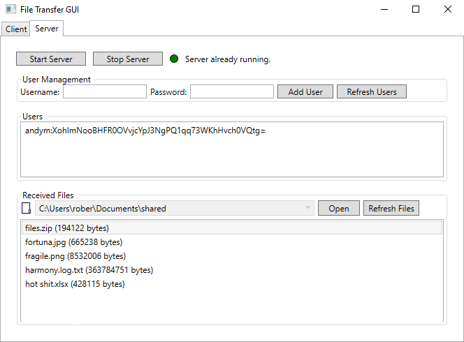

# FileTransferApp

A **secure, cross-platform file-transfer utility** written in C#/.NET 8. The solution contains three sibling projects:

| Project | Type | Purpose |
|---------|------|---------|
| `Server` | Console app | Listens on port 5000 and receives files. |
| `Client` | Console app | Sends a file to the server (handy for automation / scripting). |
| `GUI`    | WPF desktop app | Friendly interface that can start/stop the server, manage users and send files or whole folders. |

<p align="center">
  
  <br/>
  <em>Running server + GUI in the same window</em>
</p>

---

## Features

* 🔐 **TLS 1.2/1.3 encryption** – all data is protected in transit.
* 🖋 **HMAC challenge-response authentication** – prevents password sniffing/replay attacks.
* 👥 **Multi-user support** via a simple `users.txt` file.
* 📂 **Send single files or zip entire folders.** Optional auto-zipping of multiple selections.
* 📶 **Progress bar** & status updates in the GUI.
* 🖱 **Drag-&-drop** support.
* 🚦 GUI can **start/stop the server** and inspect received files.
* 🗃 Output is saved in your **Documents/shared** folder by default.
* 🏃‍♂️ Completely **self-contained** – no database, no external services.

---

## Prerequisites

* [.NET SDK 8.0+](https://dotnet.microsoft.com/) (cross-platform)
* Windows 10/11 is required for the WPF GUI; the CLI `Client` & `Server` run on Linux/macOS too.

---

## Building the solution

```powershell
# clone the repo
 git clone https://github.com/AMoir117/dotnet-learning.git
 cd dotnet-learning

# restore & build everything
 dotnet build FileTransferApp/FileTransferApp.sln -c Release
```

Artifacts appear in the usual `bin/Release` sub-folders of each project.

---

## Quick start

### 1. Run the GUI

```powershell
 dotnet run --project FileTransferApp/GUI
```


---
## Architecture & Protocol

1. **TLS handshake** (certificate validation currently skipped – BYO PKI).
2. Server sends a random **32-byte nonce**.
3. Client replies with padded username (64 bytes) + **HMAC-SHA-256(nonce, passwordHash)** (32 bytes).
4. Server validates and returns `AUTH_OK` / `AUTH_FAIL`.
5. Client streams filename (256 bytes) followed by raw file data.
6. Server writes the data to disk and ends with `SUCCESS`.

See `Protocol.cs` in each project for exact constants.

---

## Screenshots

<p align="center">
  
</p>

---

## Roadmap / Ideas

* Real certificate validation (mutual TLS or LetsEncrypt).
* Better GUI

---

## License

This project is released under the MIT License – see [LICENSE](LICENSE) for details.
